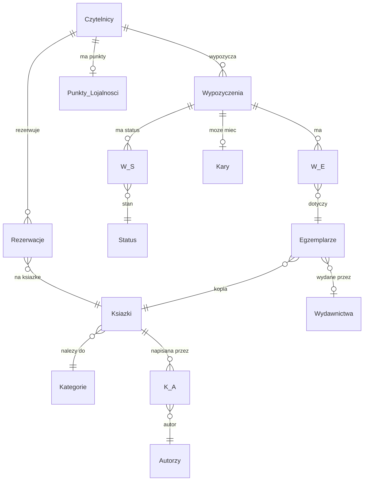

# Diagram ERD - System Biblioteka

## Opis encji

| Tabela | Liczba kolumn | Klucz glowny | Opis |
|--------|---------------|--------------|------|
| Czytelnicy | 5 | id_czytelnik | Zarejestrowani uzytkownicy biblioteki |
| Autorzy | 3 | id_autor | Autorzy ksiazek |
| Kategorie | 2 | id_kategoria | Klasyfikacja tematyczna ksiazek |
| Wydawnictwa | 4 | id_wydawnictwo | Wydawcy egzemplarzy |
| Ksiazki | 3 | id_ksiazka | Logiczne tytuly w katalogu |
| Egzemplarze | 4 | id_egzemplarz | Fizyczne kopie ksiazek |
| Wypozyczenia | 4 | id_wypozyczenie | Historia wypozyczen |
| Kary | 4 | id_kara | Naliczone kary (UNIQUE per wypozyczenie) |
| Status | 2 | id_status | Slownik statusow |
| K_A | 2 | (id_ksiazka, id_autor) | N:M ksiazka-autor |
| W_E | 2 | (id_wypozyczenie, id_egzemplarz) | N:M wypozyczenie-egzemplarz |
| W_S | 4 | id_ws | Historia zmian statusu wypozyczenia |
| Rezerwacje | 6 | id_rezerwacji | Kolejka rezerwacji FIFO |
| Punkty_Lojalnosci | 4 | id_czytelnik | System lojalnosciowy |
| Log_Operacji | 7 | id_log | Generyczny audit log (JSON) |
| Audyt_Czytelnicy | 7 | id_audyt | Audyt usunietych czytelnikow |
| Statystyki_Dzienne | 6 | data_dnia | Migawki dziennych statystyk |
